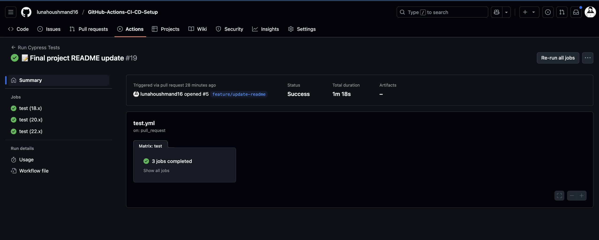

# GitHub-Actions-CI-CD-Setup

## Description

This project is a Tech Quiz application enhanced with Cypress tests for both component and end-to-end (E2E) testing. It ensures reliability and robustness in modern web applications through comprehensive automated testing.The app is built using the MERN stack with a React front end, MongoDB database, and Node.js/Express.js server and API. It allows users to take a quiz of ten random questions and view their final score.

- **Motivation:** To implement modern DevOps practices (CI/CD) using GitHub Actions while developing a full-stack quiz application.
- **Purpose:** Ensure clean code integrations and seamless deployment when changes are merged.
- **Problem Solved:** Manual testing and deployment delays; adds automation for better scalability.
- **What I Learned:** CI/CD workflows, deploy hooks, component/E2E testing, and cloud deployment with Render.

## Table of Contents

- [Installation](#installation)
- [Usage](#usage)
- [Credits](#credits)
- [License](#license)
- [Badges](#badges)
- [Features](#features)
- [How to Contribute](#how-to-contribute)
- [Tests](#tests)
- [Render live Link](#Render-live-Link)

## Installation

1. Clone the repository:
   ```sh
   git clone https://github.com/lunahoushmand16/GitHub-Actions-CI-CD-Setup
   ```
2. Navigate to the project folder:
   ```sh
   cd GitHub-Actions-CI-CD-Setup 
   ```
3. Install dependencies:
    ```sh
   npm install
   ```
4. Seed the database:
   ```sh
   npm run seed
   ```
5. Start the app (both server and client):
   ```sh
   npm run start:dev
   ```

## Usage

- Open your browser and navigate to: http://localhost:3000

- Click Start Quiz to begin.

- Answer the multiple-choice questions.

- At the end, view your final score.

- Option to start a new quiz.

### Screenshots:




## Credits

- Created by **[Luna Houshmans](https://github.com/lunahoushmand16)**
- Technologies used: 
  - **[Express.js](https://expressjs.com/)**
  - **[TypeScript](https://www.typescriptlang.org/)**
  - **[Cloud MongoDB ](https://www.mongodb.com/)**
  - **[Mongoose](https://mongoosejs.com/)** 
  - **[React.js](https://react.dev/)**
  - **[Vitejs](https://vite.dev/)**
  - **[Node.js](https://nodejs.org/en)**
  - **[Cypress (for testing)](https://www.cypress.io/)**
  - **[Render (for deployment)](https://render.com/)**

## License

This project is licensed under the **MIT License**. See the [LICENSE](LICENSE) file for details.

## Badges


## Features

- Dynamic quiz generation with random questions

- Tracks score and quiz progress

- Allows quiz restart

- MERN stack architecture

- Loading spinner while fetching questions

- Comprehensive Cypress testing (component & E2E)

- Database seeding with predefined question sets

- Automated CI/CD workflow with GitHub Actions

- Auto-deploy to Render when develop is merged

## How to Contribute

1. Fork the repository
2. Create a new branch: `git checkout -b feature-name`
3. Make changes and commit: `git commit -m 'Add feature X'`
4. Push changes: `git push origin feature-name`
5. Open a pull request

## Tests
This project includes automated Cypress testing:

✅ Component tests

 - Verifies the Quiz component renders questions and answer options

 - Checks button click interactions

 - Tests quiz progression and scoring

✅ End-to-End (E2E) tests

 - Simulates full user flow: starting quiz, answering questions, completing quiz

 - Confirms UI updates and scoring work as expected

Tests can be run using:
  ```sh
  npx cypress open
  ```

## Render live Link 

[Render live Link](https://github-actions-ci-cd-setup-n7a5.onrender.com)